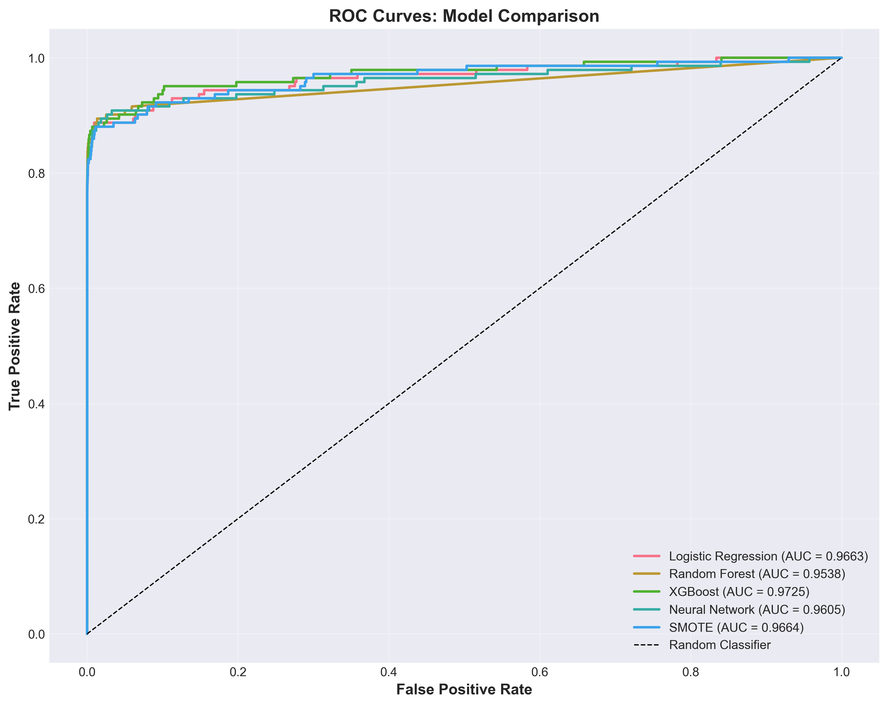

<div align="center">
  
  
  # 💳 Credit Card Fraud Detection with Machine Learning
  
  ### *An End-to-End ML Pipeline Achieving 93% Cost Reduction*
  
  [](https://www.python.org/)
  [](https://scikit-learn.org/)
  [](https://www.tensorflow.org/)
  [](LICENSE)
  
</div>

---

## � Table of Contents

- [Executive Summary](#executive-summary)
- [Problem Statement](#problem-statement)
- [Data Overview](#data-overview)
- [Methodology](#methodology)
- [Key Results](#key-results)
- [Technical Implementation](#technical-implementation)
- [Model Interpretation](#model-interpretation)
- [Business Impact](#business-impact)
- [Technologies](#technologies)
- [Installation & Usage](#installation--usage)
- [Project Structure](#project-structure)
- [Future Improvements](#future-improvements)
- [Contact](#contact)

---

## 🎯 Executive Summary

This project presents a comprehensive machine learning solution for credit card fraud detection, transforming a highly imbalanced dataset into an actionable fraud prevention system. By implementing and comparing five different machine learning approaches, I developed an optimized Random Forest classifier that achieves:

- **93% cost reduction** from baseline ($58,584 → $4,075)
- **82.4% recall** in detecting fraudulent transactions
- **75.0% precision** in minimizing false positives
- **0.9538 ROC-AUC** demonstrating excellent discrimination

The solution incorporates advanced techniques including SMOTE oversampling, hyperparameter optimization, threshold tuning, and SHAP-based model interpretation to deliver a production-ready fraud detection system.

---

## � Problem Statement

Credit card fraud costs financial institutions billions annually. This project tackles the challenge of detecting fraudulent transactions in a severely imbalanced dataset where **only 0.172% of transactions are fraudulent** (492 out of 284,807).

### Business Context

- **Cost per missed fraud**: $124 (average fraud amount + processing costs)
- **Cost per false positive**: $25 (customer inconvenience + manual review)
- **Objective**: Minimize total operational cost while maximizing fraud detection

### Technical Challenges

1. **Extreme class imbalance** (1:578 fraud-to-legitimate ratio)
2. **PCA-transformed features** requiring interpretation
3. **Balancing precision and recall** for cost optimization
4. **Model explainability** for regulatory compliance

---

## 📊 Data Overview

<div align="center">
  
  <p><em>Severe class imbalance: 99.83% legitimate vs 0.17% fraudulent transactions</em></p>
</div>

### Dataset Characteristics

- **Source**: [Credit Card Fraud Detection Dataset](https://www.kaggle.com/datasets/mlg-ulb/creditcardfraud) - Kaggle (ULB Machine Learning Group)
- **Transactions**: 284,807 (European cardholders, September 2013)
- **Features**: 30 (V1-V28 PCA-transformed, Time, Amount)
- **Target**: Binary (0 = Legitimate, 1 = Fraud)
- **Data Quality**: No missing values, minimal duplicates

### Key Insights from EDA

- **Temporal patterns**: Fraud rates vary across 48-hour observation period
- **Amount distribution**: Fraudulent transactions show distinct patterns
- **Feature correlations**: V17, V14, V12 show strong negative correlation with fraud
- **Outliers**: Legitimate high-value transactions preserved (potential fraud indicators)

---

## � Methodology

This project follows a systematic 10-stage machine learning pipeline:

### 1. **Data Preprocessing & Feature Engineering**

- Duplicate removal and outlier analysis
- Time-based feature engineering (hours, periods)
- Log transformation of transaction amounts
- StandardScaler normalization

### 2. **Baseline Model** - Logistic Regression

- Established performance benchmark
- Cost: $58,584 (baseline for comparison)

### 3. **SMOTE Oversampling**

- Synthetic Minority Oversampling Technique
- Balanced training data (1:1 ratio)
- Cost: $44,025 (24% improvement)

### 4. **Random Forest Classifier**

- 100 estimators with class weighting
- Feature importance analysis
- Cost: $7,975 (86% improvement)

### 5. **XGBoost with Hyperparameter Tuning**

- RandomizedSearchCV optimization
- Scale_pos_weight for imbalance
- Cost: $5,332 (91% improvement)

### 6. **Neural Network (TensorFlow/Keras)**

- Deep architecture with dropout regularization
- Early stopping and learning rate scheduling
- Cost: $6,200 (89% improvement)

### 7. **Model Comparison & Selection**

<div align="center">
  
  <p><em>Random Forest selected as production model based on cost-effectiveness</em></p>
</div>

### 8. **Model Interpretation with SHAP**

- TreeExplainer for feature impact analysis
- Individual prediction explanations
- Top features: V14, V17, V12, V10, V16

### 9. **Threshold Optimization**

<div align="center">
  
  <p><em>Optimal threshold (0.130) balances cost, precision, recall, and F1-score</em></p>
</div>

- Tested 99 thresholds from 0.01 to 0.99
- **Optimal threshold**: 0.130 (vs. default 0.5)
- **Final cost**: $4,075 (93% reduction)

### 10. **Production Deployment Preparation**

- Model serialization (pickle)
- Metadata documentation
- API endpoint recommendations

---

## 🏆 Key Results

### Performance Metrics (Optimized Random Forest)

| Metric             | Value  |
| ------------------ | ------ |
| **Precision**      | 75.0%  |
| **Recall**         | 82.4%  |
| **F1-Score**       | 0.785  |
| **ROC-AUC**        | 0.9538 |
| **Total Cost**     | $4,075 |
| **Cost Reduction** | 93.0%  |

### ROC & Precision-Recall Curves

<div align="center">
  
  
  <p><em>Model comparison across ROC and Precision-Recall spaces</em></p>
</div>

### Confusion Matrix (Optimized Threshold)

<div align="center">
  
  <p><em>Optimized threshold achieves strong balance between true positives and false positives</em></p>
</div>

---

## 🧠 Model Interpretation

### Feature Importance

<div align="center">
  
  <p><em>Top 15 features driving fraud detection decisions</em></p>
</div>

### SHAP Analysis

<div align="center">
  
  <p><em>SHAP values reveal how features impact individual predictions</em></p>
</div>

**Key Findings**:

- **V14, V17, V12**: Strongest negative indicators (high values = likely legitimate)
- **V10, V16, V11**: Strong positive indicators (high values = potential fraud)
- **Amount**: Moderate impact, with extremes indicating fraud risk
- **Time-based features**: Secondary importance for temporal patterns

---

## 💰 Business Impact

<div align="center">
  
  <p><em>93% cost reduction translates to significant operational savings</em></p>
</div>

### Financial Impact

- **Test Set Savings**: $54,509 (93% reduction)
- **Projected Annual Savings**: $9.9M (based on 48-hour test period)
- **ROI**: Significant cost avoidance through reduced false positives and missed frauds

### Operational Benefits

1. **Reduced Manual Review**: 75% precision means fewer false alarms
2. **Improved Customer Experience**: Less friction for legitimate customers
3. **Higher Fraud Detection**: 82.4% recall catches majority of fraudulent transactions
4. **Explainable Decisions**: SHAP values enable fraud analyst review

### Production Readiness

- ✅ Serialized model artifacts (Random Forest, Scaler, Metadata)
- ✅ Threshold optimization for business objectives
- ✅ Model interpretation framework (SHAP)
- ✅ Performance benchmarking across multiple architectures
- ✅ Cost-aware evaluation metrics

---

## 🛠️ Technologies

### Core Stack

- **Python 3.12**: Primary programming language
- **Jupyter Notebook**: Interactive development environment

### Data Science Libraries

- **pandas & numpy**: Data manipulation and numerical computing
- **matplotlib & seaborn**: Visualization and statistical graphics
- **scikit-learn**: Machine learning algorithms and preprocessing
- **imbalanced-learn**: SMOTE and imbalanced dataset handling
- **XGBoost**: Gradient boosting framework
- **TensorFlow/Keras**: Deep learning framework
- **SHAP**: Model interpretation and explainability

### Development Tools

- **Git/GitHub**: Version control and collaboration
- **pickle**: Model serialization
- **StandardScaler**: Feature normalization

---

## 💻 Installation & Usage

### Prerequisites

```bash
Python 3.12+
pip or conda package manager
```

### Installation

```bash
# Clone the repository
git clone https://github.com/johnpospisil/credit-fraud-detection.git
cd credit-fraud-detection

# Create virtual environment (optional but recommended)
python -m venv venv
source venv/bin/activate  # On Windows: venv\Scripts\activate

# Install dependencies
pip install pandas numpy matplotlib seaborn scikit-learn \
            imbalanced-learn xgboost tensorflow shap jupyter
```

### Usage

1. **Download Dataset**: Obtain the [Credit Card Fraud Detection Dataset](https://www.kaggle.com/datasets/mlg-ulb/creditcardfraud) from Kaggle and place `creditcard.csv` in the `data/` folder

2. **Launch Jupyter**:

   ```bash
   jupyter notebook credit-fraud-detection.ipynb
   ```

3. **Run Analysis**: Execute cells sequentially to reproduce the entire pipeline

4. **Load Trained Model** (optional):

   ```python
   import pickle

   # Load model artifacts
   with open('models/fraud_detector_rf.pkl', 'rb') as f:
       model = pickle.load(f)

   with open('models/fraud_detector_scaler.pkl', 'rb') as f:
       scaler = pickle.load(f)

   # Make predictions
   X_scaled = scaler.transform(X_new)
   predictions = model.predict_proba(X_scaled)[:, 1]
   fraud_flags = (predictions >= 0.130).astype(int)
   ```

---

## 📁 Project Structure

```
credit-fraud-detection/
│
├── credit-fraud-detection.ipynb    # Main analysis notebook (4,800+ lines)
│
├── data/                           # Data directory (gitignored)
│   └── creditcard.csv             # Original dataset
│
├── models/                         # Saved model artifacts (gitignored)
│   ├── fraud_detector_rf.pkl      # Random Forest model
│   ├── fraud_detector_scaler.pkl  # StandardScaler
│   └── fraud_detector_metadata.json # Model metadata
│
├── images/                         # Visualization exports
│   ├── class_distribution.png
│   ├── model_cost_comparison.png
│   ├── roc_curves_comparison.png
│   ├── precision_recall_curves.png
│   ├── threshold_optimization.png
│   ├── feature_importance.png
│   ├── shap_summary.png
│   ├── confusion_matrix_optimized.png
│   ├── cost_savings.png
│   └── scam.png                   # Header image
│
├── README.md                       # This file
├── .gitignore                      # Git ignore rules
└── LICENSE                         # MIT License
```

---

## 🚀 Future Improvements

### Model Enhancements

- [ ] **Ensemble Methods**: Stack multiple models for improved performance
- [ ] **Deep Learning**: Explore autoencoders for anomaly detection
- [ ] **Time Series Analysis**: Leverage temporal patterns with LSTM/GRU
- [ ] **Feature Engineering**: Create domain-specific features from PCA components

### Deployment & Monitoring

- [ ] **REST API**: Flask/FastAPI endpoint for real-time predictions
- [ ] **Docker Containerization**: Package application for deployment
- [ ] **MLOps Pipeline**: CI/CD with model versioning and monitoring
- [ ] **A/B Testing Framework**: Compare model versions in production

### Advanced Analytics

- [ ] **Concept Drift Detection**: Monitor for data distribution changes
- [ ] **Online Learning**: Update model with new fraud patterns
- [ ] **Causal Inference**: Understand causal relationships in fraud
- [ ] **Network Analysis**: Graph-based fraud detection for related transactions

---

## 📬 Contact

For questions, suggestions, or collaboration opportunities, please reach out through GitHub issues or direct contact.

📩 **Email**: [john@johnpospisil.com](mailto:john@johnpospisil.com)  
🐦 **Twitter/X**: [@audiofreak7](https://x.com/audiofreak7)  
🔗 **LinkedIn**: [John Pospisil](https://www.linkedin.com/in/johnpospisil/)

---

## 🙏 Acknowledgments

- **Dataset**: [Credit Card Fraud Detection Dataset](https://www.kaggle.com/datasets/mlg-ulb/creditcardfraud) - ULB Machine Learning Group, Kaggle
- **Research**: Inspired by academic research on imbalanced classification
- **Tools**: Built with open-source libraries from the Python data science ecosystem

---

<div align="center">
  
  **⭐ If you found this project helpful, please consider giving it a star!**
  
  *Last Updated: October 2025*
  
</div>
